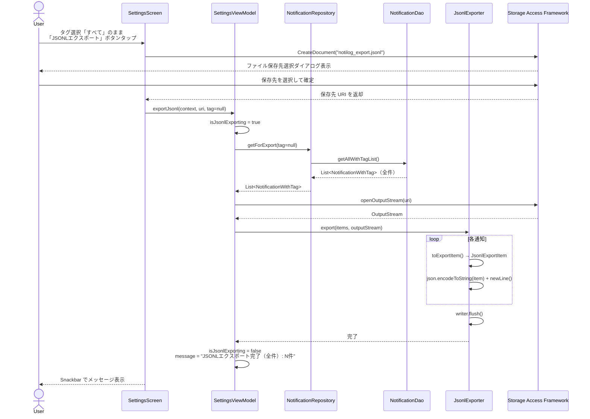
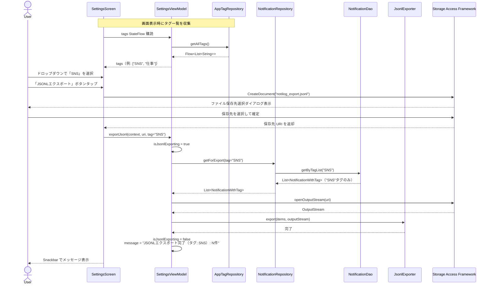

# シーケンス図: JSONL エクスポートフロー

> **対象機能**: F-15 JSONL エクスポート  
> **最終更新**: 2026-04-05

---

## 1. 全件エクスポートフロー



---

## 2. タグフィルタエクスポートフロー



---

## 3. JSONL 出力フォーマット

### 3.1 フォーマット概要

- ファイル拡張子: `.jsonl`
- エンコーディング: UTF-8
- 改行コード: LF (`\n`)
- 1 行 = 1 通知（JSON オブジェクト）
- 最後の行末に改行あり

### 3.2 フィールド仕様

| フィールド | 型 | 説明 |
|---|---|---|
| `id` | Long | DB 主キー（同一端末のみ有効） |
| `packageName` | String | 通知発行元パッケージ名 |
| `title` | String? | 通知タイトル（null 可） |
| `text` | String? | 通知テキスト（null 可） |
| `bigText` | String? | 拡張テキスト（null 可） |
| `subText` | String? | サブテキスト（null 可） |
| `ticker` | String? | ティッカーテキスト（null 可） |
| `tag` | String? | アプリに付与されたタグ（タグなしの場合 null） |
| `appLabel` | String? | アプリ表示名キャッシュ（null 可） |
| `notificationType` | String | 通知種別コード（`local`, `remote_push` 等） |
| `receiveCount` | Int | 同一通知の受信回数 |
| `firstReceivedAt` | Long | 初回受信時刻（Unix ミリ秒） |
| `lastReceivedAt` | Long | 最終受信時刻（Unix ミリ秒） |

### 3.3 出力例

```jsonl
{"id":1,"packageName":"com.example.sns","title":"新しいメッセージ","text":"田中さんからメッセージが届きました","bigText":null,"subText":null,"ticker":null,"tag":"SNS","appLabel":"SNSアプリ","notificationType":"remote_push","receiveCount":1,"firstReceivedAt":1743811200000,"lastReceivedAt":1743811200000}
{"id":2,"packageName":"com.example.mail","title":null,"text":"メール受信","bigText":"本文テキスト","subText":"受信トレイ","ticker":"メール受信","tag":"仕事","appLabel":"メールアプリ","notificationType":"local","receiveCount":3,"firstReceivedAt":1743800000000,"lastReceivedAt":1743811000000}
```

---

## 4. 設計上の留意点

| 項目 | 詳細 |
|---|---|
| **暗号化なし** | JSONL エクスポートはプレーンテキストである。バックアップ用途には既存の暗号化バックアップ（`notilog_backup.bin`）を使用すること |
| **SAF 経由** | ファイル保存はすべて Storage Access Framework 経由。アプリはファイルシステムへの直接アクセスを行わない |
| **extras_json / raw_json は含まない** | プライバシー上の配慮から、生 extras データおよび raw_json は JSONL に含めない |
| **id は端末固有** | `id` フィールドは DB の autoincrement 値のため、別端末へのインポート時には使用しないこと |

