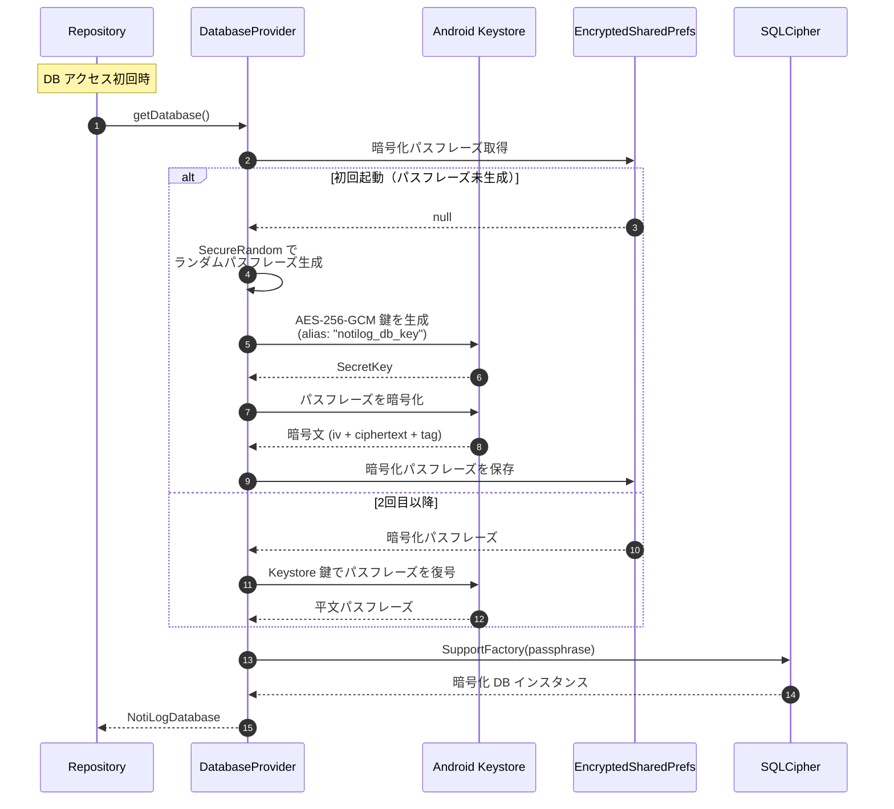

# シーケンス図: 通知受信〜保存フロー

> 対象機能: F-01 通知キャプチャ / F-02 重複通知の集約 / F-12 通知種別分類  
> 参照: [DESIGN.md §4.2 通知キャプチャの詳細フロー](./DESIGN.md#42-通知キャプチャの詳細フロー) / [DESIGN.md §4.4 通知種別分類ロジック](./DESIGN.md#44-通知種別分類ロジックf-12)

---

## 1. テキスト形式シーケンス図

### 1.1 新規通知の場合

```
Android OS          ListenerService         Repository            暗号化DB              UI
    │                     │                     │                     │                  │
    │  onNotificationPosted(sbn)                │                     │                  │
    │────────────────────▶│                     │                     │                  │
    │                     │                     │                     │                  │
    │                     │ sbn から抽出:        │                     │                  │
    │                     │  packageName        │                     │                  │
    │                     │  title / text       │                     │                  │
    │                     │  bigText / subText  │                     │                  │
    │                     │  ticker / extras    │                     │                  │
    │                     │                     │                     │                  │
    │                     │ classifyNotification│                     │                  │
    │                     │  flags/priority/    │                     │                  │
    │                     │  extras → 7種別判定 │                     │                  │
    │                     │                     │                     │                  │
    │                     │ SHA-256 signature   │                     │                  │
    │                     │ 生成                │                     │                  │
    │                     │                     │                     │                  │
    │                     │  upsert(entity)     │                     │                  │
    │                     │────────────────────▶│                     │                  │
    │                     │                     │                     │                  │
    │                     │                     │  SELECT ... WHERE   │                  │
    │                     │                     │  signature = :sig   │                  │
    │                     │                     │  LIMIT 1            │                  │
    │                     │                     │────────────────────▶│                  │
    │                     │                     │                     │                  │
    │                     │                     │  結果: null（未存在）│                  │
    │                     │                     │◀────────────────────│                  │
    │                     │                     │                     │                  │
    │                     │                     │  INSERT INTO        │                  │
    │                     │                     │  notifications      │                  │
    │                     │                     │  (receiveCount=1,   │                  │
    │                     │                     │   firstReceivedAt   │                  │
    │                     │                     │   =now)             │                  │
    │                     │                     │────────────────────▶│                  │
    │                     │                     │                     │                  │
    │                     │                     │  INSERT INTO        │                  │
    │                     │                     │  notifications_fts  │                  │
    │                     │                     │  (FTS インデックス)  │                  │
    │                     │                     │────────────────────▶│                  │
    │                     │                     │                     │                  │
    │                     │                     │         OK          │                  │
    │                     │                     │◀────────────────────│                  │
    │                     │                     │                     │                  │
    │                     │       完了          │                     │                  │
    │                     │◀────────────────────│                     │                  │
    │                     │                     │                     │                  │
    │                     │                     │                     │  Flow<List>      │
    │                     │                     │                     │  自動 emit       │
    │                     │                     │                     │─────────────────▶│
    │                     │                     │                     │                  │
    │                     │                     │                     │        リスト再描画│
    │                     │                     │                     │                  │
```

### 1.2 重複通知の場合

```
Android OS          ListenerService         Repository            暗号化DB              UI
    │                     │                     │                     │                  │
    │  onNotificationPosted(sbn)                │                     │                  │
    │────────────────────▶│                     │                     │                  │
    │                     │                     │                     │                  │
    │                     │ sbn から抽出         │                     │                  │
    │                     │ + classifyNotification                     │                  │
    │                     │ + SHA-256 signature │                     │                  │
    │                     │                     │                     │                  │
    │                     │  upsert(entity)     │                     │                  │
    │                     │────────────────────▶│                     │                  │
    │                     │                     │                     │                  │
    │                     │                     │  SELECT ... WHERE   │                  │
    │                     │                     │  signature = :sig   │                  │
    │                     │                     │  LIMIT 1            │                  │
    │                     │                     │────────────────────▶│                  │
    │                     │                     │                     │                  │
    │                     │                     │  結果: 既存レコード  │                  │
    │                     │                     │◀────────────────────│                  │
    │                     │                     │                     │                  │
    │                     │                     │  UPDATE             │                  │
    │                     │                     │  notifications SET  │                  │
    │                     │                     │  receive_count + 1, │                  │
    │                     │                     │  last_received_at   │                  │
    │                     │                     │  = now              │                  │
    │                     │                     │────────────────────▶│                  │
    │                     │                     │                     │                  │
    │                     │                     │         OK          │                  │
    │                     │                     │◀────────────────────│                  │
    │                     │                     │                     │                  │
    │                     │       完了          │                     │                  │
    │                     │◀────────────────────│                     │                  │
    │                     │                     │                     │                  │
    │                     │                     │                     │  Flow<List>      │
    │                     │                     │                     │  自動 emit       │
    │                     │                     │                     │─────────────────▶│
    │                     │                     │                     │                  │
    │                     │                     │                     │  受信回数・時刻   │
    │                     │                     │                     │  更新反映        │
    │                     │                     │                     │                  │
```

---

## 2. Mermaid 形式シーケンス図

### 2.1 統合フロー（新規 / 重複の分岐を含む）

```mermaid
sequenceDiagram
    autonumber
    participant OS as Android OS
    participant SVC as NotiLogListenerService
    participant REPO as NotificationRepository
    participant DB as 暗号化DB<br/>(Room + SQLCipher)
    participant UI as Jetpack Compose UI

    OS->>SVC: onNotificationPosted(sbn)

    Note over SVC: StatusBarNotification から抽出<br/>packageName / title / text<br/>bigText / subText / ticker / extras

    Note over SVC: classifyNotification()<br/>flags / priority / extras から<br/>7 種別を判定

    Note over SVC: SignatureGenerator.generate()<br/>SHA-256(packageName + title<br/>+ text + bigText + subText)

    SVC->>REPO: upsert(notificationEntity)

    REPO->>DB: SELECT * FROM notifications<br/>WHERE signature = :sig LIMIT 1

    alt signature が未存在（新規通知）
        DB-->>REPO: null

        REPO->>DB: INSERT INTO notifications<br/>(receiveCount=1,<br/>firstReceivedAt=now,<br/>lastReceivedAt=now)

        REPO->>DB: INSERT INTO notifications_fts<br/>(title, text, bigText, subText)

        DB-->>REPO: OK

    else signature が既存（重複通知）
        DB-->>REPO: 既存レコード

        REPO->>DB: UPDATE notifications SET<br/>receive_count = receive_count + 1,<br/>last_received_at = :now<br/>WHERE signature = :sig

        DB-->>REPO: OK
    end

    REPO-->>SVC: 完了

    Note over DB,UI: Room Flow による自動通知

    DB-)UI: Flow&lt;List&lt;NotificationEntity&gt;&gt; emit

    Note over UI: LazyColumn リスト再描画<br/>（新規行追加 or 受信回数・時刻更新）
```

### 2.2 DB 暗号化レイヤーの詳細（補足）



---

## 3. 処理ステップ一覧

| # | 発信元 | 受信先 | 処理内容 | 備考 |
|---|---|---|---|---|
| 1 | Android OS | ListenerService | `onNotificationPosted(sbn)` コールバック | システムがバインドしたサービスに通知を配信 |
| 2 | ListenerService | (内部処理) | `StatusBarNotification` からフィールド抽出 | `notification.extras` から title / text / bigText / subText / ticker を取得 |
| 2a | ListenerService | (内部処理) | `NotificationExtractor.classifyNotification()` | flags → FLAG_FOREGROUND_SERVICE / ONGOING_EVENT / GROUP_SUMMARY の順に判定。次に FCM マーカーキーの有無 + priority で 7 種別に分類 |
| 3 | ListenerService | (内部処理) | `SignatureGenerator.generate()` | `packageName + title + text + bigText + subText` の SHA-256 ハッシュ |
| 4 | ListenerService | Repository | `upsert(entity)` | Dispatchers.IO コルーチンで実行 |
| 5 | Repository | 暗号化DB | `SELECT ... WHERE signature = :sig` | UNIQUE INDEX による高速検索 |
| 6a | Repository | 暗号化DB | `INSERT INTO notifications` | 新規通知: receiveCount=1 |
| 6b | Repository | 暗号化DB | `UPDATE notifications SET receive_count + 1` | 重複通知: カウントと時刻を更新 |
| 7 | 暗号化DB | UI | `Flow<List<NotificationEntity>>` emit | Room の invalidation tracker が変更を検知し自動発火 |
| 8 | UI | (内部処理) | Compose 再コンポジション | `collectAsStateWithLifecycle()` で Flow を State に変換 |

